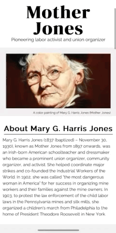

# FreeCodeCamp Tribute Page Project

This project is my entry for the Free Code Camp tribute page project, part of the responsive web design curriculum. It features ths basics of HTML and CSS, with an emphasis on mobile first development.

## Live Demo

You can view a live demo of the project in your browser [here](https://devloggith.github.io/fcc-tribute-page-project/).

## Features

- Responsive design
- Mobile first development
- Adherence to accessability standards

## Technologies Used

- HTML
  - Proper semantic usage and structure
  - Flexbox
- CSS
  - Reset
  - Clamp functions